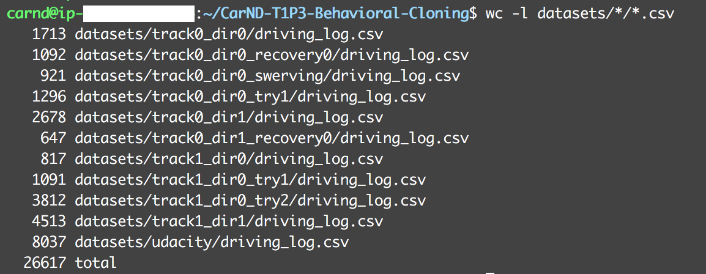

# **Behavioral Cloning Project**

The goals / steps of this project are the following:

* Use the simulator to collect data of good driving behavior
* Build a convolution neural network in Keras that predicts steering angles from images
* Train and validate the model with a training and validation set
* Test that the model successfully drives around track one without leaving the road
* Summarize the results with a written report

## Rubric Points
### Here I will consider the [rubric points](https://review.udacity.com/#!/rubrics/432/view) individually and describe how I addressed each point in my implementation.  

---
### Files Submitted & Code Quality

#### 1. Submission includes all required files and can be used to run the simulator in autonomous mode

My project includes the following files:

* `model.py` containing the script to create and train the model
* `drive.py` for driving the car in autonomous mode
* `model.h5` containing a trained convolution neural network 
* `writeup_report.md` summarizing the results

#### 2. Submission includes functional code
Using the Udacity provided simulator and my drive.py file, the car can be driven autonomously around the track by executing 
```sh
python drive.py model.h5
```

#### 3. Submission code is usable and readable

The model.py file contains the code for training and saving the convolution neural network. The file shows the pipeline I used for training and validating the model, and it contains comments to explain how the code works.

### Model Architecture and Training Strategy

#### 1. An appropriate model architecture has been employed

My model consists of a convolution neural network with 5x5 and 3x3 filter sizes and depths between 24 and 64 (model.py lines 92-105) 

The model includes RELU layers to introduce nonlinearity (code lines 95-99, 102), and the data is normalized in the model using a Keras lambda layer (code line 94). 

#### 2. Attempts to reduce overfitting in the model

The model contains a dropout layer in order to reduce overfitting (model.py line 101). 

The model was trained and validated on different data sets to ensure that the model was not overfitting (code lines 23-37). The model was tested by running it through the simulator and ensuring that the vehicle could stay on the track.

#### 3. Model parameter tuning

The model used an adam optimizer, so the learning rate was not tuned manually (model.py line 25).

#### 4. Appropriate training data

Training data was chosen to keep the vehicle driving on the road. I used a combination of center lane driving, recovering from the left and right sides of the road ... 

For details about how I created the training data, see the next section. 

### Model Architecture and Training Strategy

#### 1. Solution Design Approach

##### Initial architecture

The overall strategy for deriving a model architecture was to use a well known architecture for end-to-end driving, and modify it by borrowing aspects from the modified LeNet model trained for the previous German traffic signs project.

My first step was to copy the convolution neural network model trained successfully by NVIDIA for their end-to-end driving application (linkes [here](https://devblogs.nvidia.com/parallelforall/deep-learning-self-driving-cars/) and [here](https://images.nvidia.com/content/tegra/automotive/images/2016/solutions/pdf/end-to-end-dl-using-px.pdf)). I thought this model might be appropriate because this model was trained on very similar dataset, coming from 3 forward-pointing cameras in the left/center/right locations, and with real-life data that were much more complex than those captured in the simulator for this project.

##### Detecting overfitting

In order to gauge how well the model was working, I split my image and steering angle data into 80% training set and 20% validation set. I found that my first model had a low mean squared error on the training set and on validation set, and both were decreasing approximately exponentially for the first few epochs; perhaps the large training dataset explains this success from the beginning.

Overfitting was detected by observing the graph of MSE losses, on training set and on validation set, over each epoch. The ideal graph would show both losses monotonically decreasing in an exponential-like manner, theasymptotically reaching a near-zero value. Any deviation from this suggests overfitting.

The final model performed as shown in this graph below.


The model was trained over a number of epochs that was conjectured to be too long. The model was also saved at the end of each epoch (model.py line 110). The losses were analyzed retroactively, and epoch `5` (the 6th epoch) was chosen to have been the last epoch before overfitting began. The model saved at this chosen epoch was chosen as the final model.

##### Modification

To combat the overfitting, dropout and activation were added because, during the previous lab on German traffic signs using LeNet, they proved to improve accuracy during training without slowing down the rate of this improvement during early epochs.

Reducing strides and adding pooling were considered. Reducing strides to 1, as was done in the traffic sign lab, is thought to prevent excessive loss of information, and max pooling would be added in its stead to reduce the width and height of the feature maps. However, the model was already performing well, so these modifications were not applied.

I used an adam optimizer so that manually training the learning rate wasn't necessary. I attempted adjusting its hyperparameters, but the default values performed the best.

##### Testing

The final step was to run the simulator to see how well the car was driving around the easy track.

In other words, qualitative human observation by me served as the measurement for the model's performance on the test dataset, while the test dataset was provided in a reinforcement fashion.

There were a few spots where the vehicle fell off the track. To improve the driving behavior in these cases, I added more recovery behavior in the training dataset. First, the car was parked at an angle facing either towards or away from the center, and sometimes stepping partially outside the pavement; then the steering was turned maximally to the correct direction; then recording was started; recording was stopped when car was stably driving in the center. I was careful to avoid recording the steering as centered when recording started.

At the end of the process, the vehicle is able to drive autonomously around the track without leaving the road.

[video.mp4](https://ysono.github.io/CarND-T1P3-Behavioral-Cloning/video.mp4) shows the car being driven at 9mph. The speed can be adjusted by changing [drive.py](drive.py) at line 47, but at higher speeds, the car swerves much worse (videos are omitted because they are large). Possible remedies are altering the model to also learn throttle, adjusting Kp and Ki control values, and adding more training samples for recovery at problem spots.

#### 2. Final Model Architecture

The final model architecture (model.py lines 92-105) consisted of a convolution neural network with the following layers and layer sizes:

| Layer                 | Description                                   |
|:---------------------:|:---------------------------------------------:|
| Input                 | 70x320x3 RGB image                            |
| Normalization         | to [-0.5, 0.5]                                |
| Convolution           | 5x5 kernel, 2x2 stride, 24 feature maps, RELU activation, no pooling |
| Convolution           | 5x5 kernel, 2x2 stride, 36 feature maps, RELU activation, no pooling |
| Convolution           | 5x5 kernel, 2x2 stride, 48 feature maps, RELU activation, no pooling |
| Convolution           | 3x3 kernel, 1x1 stride, 64 feature maps, RELU activation, no pooling |
| Convolution           | 3x3 kernel, 1x1 stride, 64 feature maps, RELU activation, no pooling |
| Dropout               | 50%                                           |
| Fully connected       | from 4224 neurons to 120 neurons, RELU activation |
| Fully connected       | 50 neurons                                    |
| Fully connected       | 10 neurons                                    |
| Fully connected       | 1 neuron                                      |

Here is a visualization of the architecture


(This visualization was generated by [model_visualize.py](model_visualize.py). Note, running it requires a different conda env, created by [requirements-keras-dot.yml](requirements-keras-dot.yml), because python 3.4 is required by `pydot-ng`, independent of keras version.)

##### Pre-processing

Images are first cropped from 160x320 to 70x320. This reduces amount of normalization calculation to (70 / 160 = 44%), and hence improved performance of training and evaluation of loss and accuracy.

The cropping size of 70px at the top and 20px at the bottom were determined empirically by looking at a few screenshots (see screenshots below).

##### Modifications from the original model

The layer sizes were unchanged, despite the difference in image size. The cropped 70x320 sizing is larger in both dimensions than 66x200 used by the original model, so it was ensured that no convolution layer from the original model would redanduntly attempt to reduce either the width or the height.

The only changes were as follows:

- Dropout was added on one fully-connected layer.
- RELU activation was added on one fully-connected layer.

#### 3. Creation of the Training Set & Training Process

To capture good driving behavior, I first recorded two laps on track one using center lane driving. Here is an example image of center lane driving:


I then recorded the vehicle recovering from the left side and right sides of the road back to center so that the vehicle would learn to .... These images show what a recovery looks like starting from ... :


Then I repeated this process on track two in order to get more data points.


To augment the data sat, I also flipped images and angles thinking that this would ... For example, here is an image that has then been flipped:


(The flipped image was generated using [dataset_flip.py](dataset_flip.py))

After the collection process, I had 26616 data points.

Pre-processing was limited to cropping and normalizing, as described above. Additional pre-processing was not necessary because data generation using the simulator was cheap to do.

Steering correction value of 0.2 seemed to produce bigger wobbing; it was eventually settled at 0.1.

I did not randomly shuffle the data set before putting 20% of the data into a validation set. (Shuffling would have improved generalization during training, between adjustments of hyperparameters and the architecture.)

Data points were collected from dirving on both tracks on both directions, and some datasets were dedicated to recovering.

- 5022 (18.9%) were generated from the first track in the default direction
- 3325 (12.5%) were generated from the first track in the opposite direction
- 5720 (21.5%) were generated from the challenging track in the default direction
- 4513 (17.0%) were generated from the challenging track in the opposite direction
- 8036 (30.2%) were provided by Udacity


(The `udacity` csv contains a header row, so 1 has to be subtracted from 8037 and 26617.)
